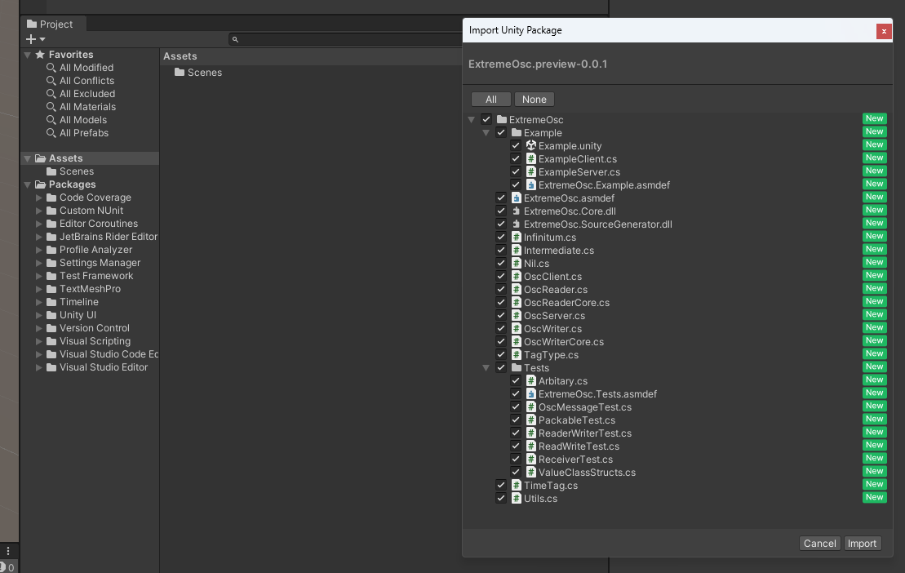

### Install from git URL

Add `https://github.com/umetaman/ExtremeOsc.git?path=Assets/ExtremeOsc` to Unity Package Manager.

```
https://github.com/umetaman/ExtremeOsc.git?path=Assets/ExtremeOsc
```

### Install from Unity Package.

Download the `.unitypackage` file from the [Releases](https://github.com/umetaman/ExtremeOsc/releases/) page on GitHub and import it into your Unity project.


