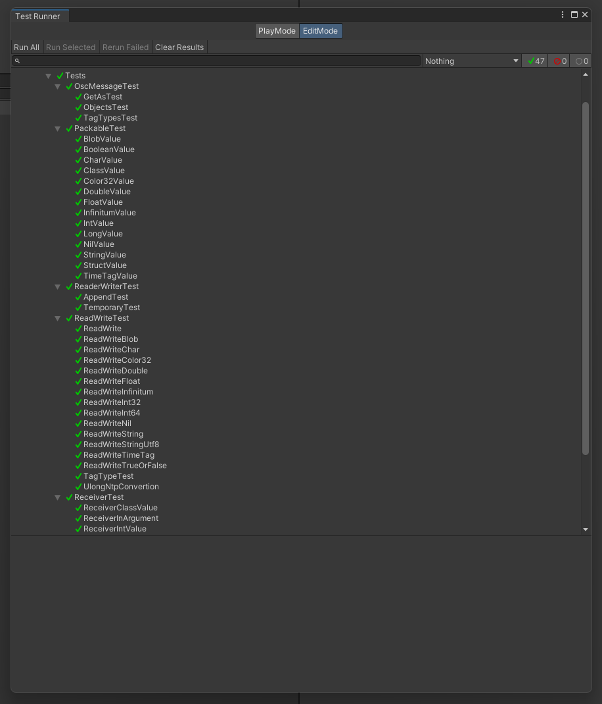

# ExtremeOsc

ExtremeOsc is C# implemetation of OSC (Open Sound Control) for Unity.

- Add functions to the class or structure to automatically convert to OSC signals.
- Specify the address for the C# function and it will automatically execute the callback by SourceGenerator.
- Created it to automate the tedious and enormous amount of coding in the Osc transmitting/receiving.

## Support Tag Types

| Tag | C# Type |
| --- | --- |
| i | int |
| h | long |
| f | float |
| s | string |
| S | Symbol |
| b | byte[] |
| d | double |
| c | char |
| r | UnityEngine.Color32 |
| t | TimeTag (DateTime) |
| T | bool (true) |
| F | bool (false) |
| N | Nil |
| I | Infinitum |
| m | MIDI as int |

## Installation

### Install from git URL

Add `https://github.com/umetaman/ExtremeOsc.git?path=Assets/ExtremeOsc` to Unity Package Manager.

```
https://github.com/umetaman/ExtremeOsc.git?path=Assets/ExtremeOsc
```

### Install from Unity Package.

Download the UnityPackage from [Releases](https://github.com/umetaman/ExtremeOsc/releases) or clone the repository.

## Getting Started

### Osc Packet

- Attach `[OscPackable]` to the class or structure to be sent.
- Attach `[OscElementAt(Index)]` to the property or field.
- Index of OscElementAt is the order of arguments.

```cs
// Must be partial
[OscPackable]
public partial class ExampleData
{
    // Must be sequencial
    [OscElementAt(0)]
    public int IntValue { get; set; }
    [OscElementAt(1)]
    public float FloatValue { get; set; }
    [OscElementAt(2)]
    public string StringValue { get; set; }

    public ExampleData()
    {
        IntValue = 0;
        FloatValue = 0.0f;
        StringValue = string.Empty;
    }
}
```

Auto generated: 

```cs
partial class ExampleData : IOscPackable
{
    // ,ifs
    public static readonly byte[] TagTypes = new byte[] { 44, 105, 102, 115 };

    public void Pack (byte[] buffer, ref int offset)
    {
        int offsetTagTypes = offset + 1;
        OscWriter.WriteString(buffer, TagTypes, ref offset);
        OscWriter.WriteInt32(buffer, IntValue, ref offset);
        offsetTagTypes++;
        OscWriter.WriteFloat(buffer, FloatValue, ref offset);
        offsetTagTypes++;
        OscWriter.WriteStringUtf8(buffer, StringValue, ref offset);
        offsetTagTypes++;
    }

    public void Unpack (byte[] buffer, ref int offset)
    {
        int offsetTagTypes = offset + 1;
        OscReader.ReadString(buffer, ref offset);
        this.IntValue = OscReader.ReadInt32(buffer, ref offset);
        offsetTagTypes++;
        this.FloatValue = OscReader.ReadFloat(buffer, ref offset);
        offsetTagTypes++;
        this.StringValue = OscReader.ReadString(buffer, ref offset);
        offsetTagTypes++;
    }
}
```

### Server, Client

Client : Send OSC signals to servers.

- `Send()` : Specify the OscPackable class or struct.

```cs
public class ExampleClient : MonoBehaviour
{
    private OscClient client = null;

    private void Awake()
    {
        client = new OscClient("127.0.0.1", 5555);
    }

    private void Update()
    {
        if(Input.GetKeyDown(KeyCode.Space))
        {
            var data = new ExampleData
            {
                IntValue = Random.Range(0, 100),
                FloatValue = Random.Range(0.0f, 1.0f),
                StringValue = "Hello, World!"
            };

            client.Send("/example", data);
        }

        if (Input.GetKeyDown(KeyCode.Return))
        {
            var data = new ExampleData
            {
                IntValue = Random.Range(0, 100),
                FloatValue = Random.Range(0.0f, 1.0f),
                StringValue = "Hello, World!"
            };

            client.Send("/example/arguments", data);
        }
    }

    private void OnDestroy()
    {
        client?.Dispose();
        client = null;
    }
}
```

Server : Receive OSC signals from clients.

- Attach [OscReceiver] to the class or struct that receives the Osc signal.
- Registers an instance of OscReceiver class to OscServer.
- Attach [OscCallback(address)] to the Osc signal callback function.

```cs
// Must be partial
[OscReceiver]
public partial class ExampleServer : MonoBehaviour
{
    private OscServer server = null;

    [OscCallback("/example/noargument")]
    private void OnExampleNoArgument(string address)
    {
        // no argument
    }

    [OscCallback("/example")]
    private void OnExample(string address, ExampleData data)
    {
        // Packable Class
    }

    [OscCallback("/example/ref")]
    private void OnExampleRef(string address, ref ExampleData data)
    {
        // Using refs can help avoid unnecessary allocations.
    }

    // Can accept class fields/properties as individual arguments
    [OscCallback("/example/arguments")]
    private void OnExampleArguments(string address, int intValue, float floatValue, string stringValue)
    {
        // primitive arguments
    }

    private void Awake()
    {
        server = new OscServer(5555);
        // Register instance to the Osc Server.
        server.Register(this);
        server.Open();
    }

    private void OnDestroy()
    {
        server.Unregister(this);
        server?.Dispose();
        server = null;
    }
}
```

## Testing

- Pack/Unpack Test
- Read/Write Test
- Receiver Callback Test



## TODO

- [x] Documentation
- [ ] Support TCP.
- [ ] Support UnityEngine classes and structs.

## References

- [OpenSoundControl Specification 1.0](https://opensoundcontrol.stanford.edu/spec-1_0.html)
- [keijiro/OscJack](https://github.com/keijiro/OscJack)
- [hecomi/uOSC](https://github.com/hecomi/uOSC)
